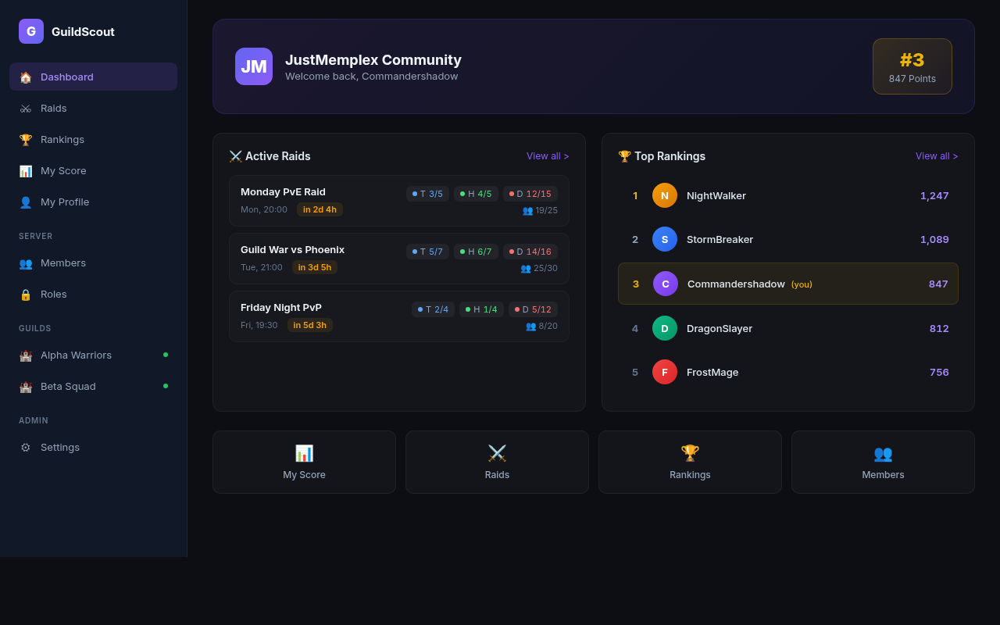
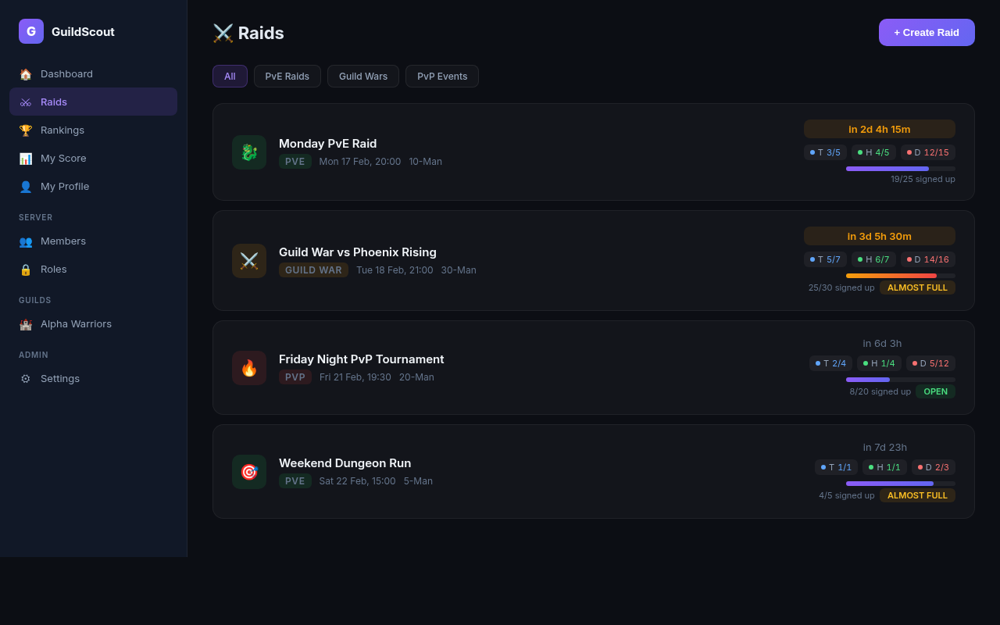
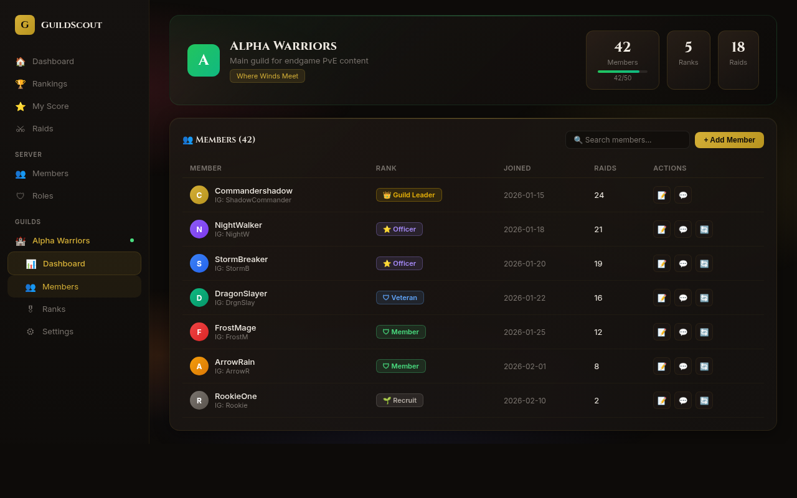
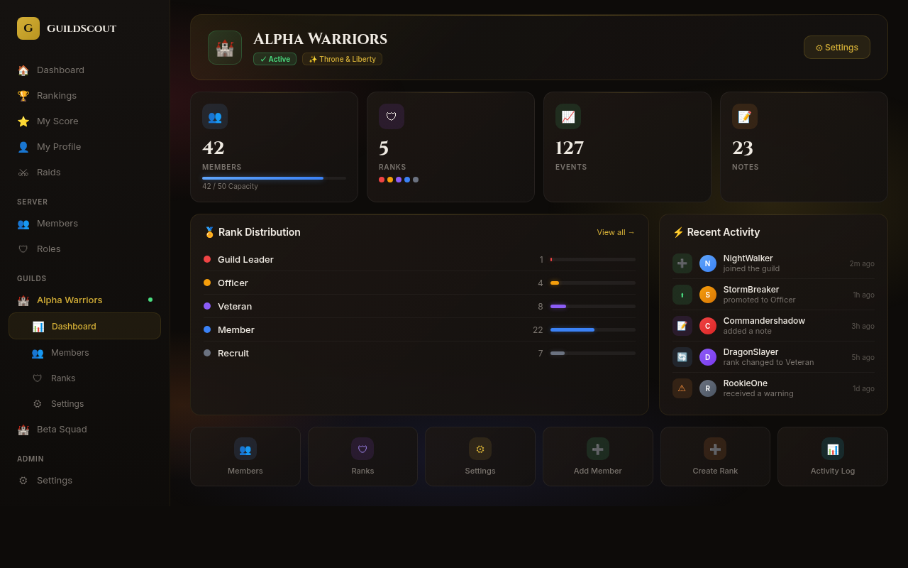

<p align="center">
  
  
  
</p>

<h1 align="center">GuildScout</h1>
<h3 align="center">Discord Guild Management Bot with Full-Featured Web Dashboard</h3>

<p align="center">
  <em>A production-ready Discord bot that ranks users based on activity, manages guild operations, and provides a modern real-time web dashboard for raid planning, member management, and analytics.</em>
</p>

---

## Screenshots

### Dashboard Overview
> Personalized dashboard with active raids, top rankings, quick actions, and live data updates via WebSocket.



### Raid Management
> Full raid planning system with category filters, role-based signups (Tank/Healer/DPS), live countdown timers, and progress tracking.



### Guild Management
> Complete ingame guild system with member tracking, rank hierarchy, Discord role sync, and officer tools (kick, ban, DM, notes).



### Guild Dashboard
> Per-guild dashboard with interactive stats, rank distribution chart, real-time activity feed, and quick action grid.



---

## Tech Stack

<table>
<tr>
<td align="center" width="150">
<strong>Backend</strong><br>
<br>
<br>
<br>

</td>
<td align="center" width="150">
<strong>Frontend</strong><br>
<br>
<br>
<br>

</td>
<td align="center" width="150">
<strong>Bot</strong><br>
<br>
<br>

</td>
<td align="center" width="150">
<strong>Infrastructure</strong><br>
<br>
<br>

</td>
</tr>
</table>

---

## Architecture

```
                    ┌──────────────────┐
                    │   React Dashboard │
                    │   (TypeScript)    │
                    └────────┬─────────┘
                             │ REST + WebSocket
                    ┌────────▼─────────┐
                    │     Go API       │
                    │    (Fiber)       │
                    └───┬────────┬─────┘
                        │        │
            ┌───────────▼──┐  ┌──▼───────────┐
            │  PostgreSQL  │  │    Redis      │
            │   (Data)     │  │  (Pub/Sub)    │
            └───────────▲──┘  └──▲───────────┘
                        │        │
                    ┌───┴────────┴─────┐
                    │   Discord Bot    │
                    │    (Python)      │
                    └──────────────────┘
```

**Key architectural decisions:**
- **Bidirectional sync** between Discord Bot and Web Dashboard via Redis Pub/Sub
- **Real-time updates** through WebSocket (no polling)
- **PostgreSQL** as single source of truth for all data
- **Bot runs on host** (systemd) while API runs in Docker (Traefik reverse proxy)

---

## Features

### Core
- **Activity-based ranking** with configurable weights (messages, voice, membership duration)
- **Real-time scoring** with percentile comparisons and visual rank cards
- **Multi-guild support** with Discord OAuth authentication
- **Internationalization** (DE/EN) for both dashboard and bot

### Raid System
- **Full lifecycle management**: Create, edit, lock, close, cancel raids
- **Template system**: Reusable raid configurations with role limits
- **Category & Mode system**: PvE, PvP, Guild Wars with different group sizes
- **Role-based signups**: Tank/Healer/DPS with auto-promote from bench
- **Weapon/Build system**: Per-signup weapon selection, displayed in Discord embeds
- **Guild War results**: Win/loss/draw tracking with MVP selection and rank points
- **iCal export**: Add raids to personal calendars
- **Push notifications**: Web Push + Discord DM with user preferences

### Guild Management
- **Ingame guild system**: Full CRUD for guilds, ranks, and members
- **Rank hierarchy**: Priority-based with Discord role auto-mapping
- **Member detail**: Event timeline, officer notes, Discord actions (kick/ban/DM/nickname)
- **Dashboard per guild**: Statistics, rank distribution, activity feed

### Permission System
- **5-tier hierarchy**: Owner > User Overrides > Discord Role Map > Legacy Roles > Member Roles
- **Per-user overrides**: Grant/deny individual permissions
- **Discord integration**: Automatic role sync on login and role changes

### Analytics
- **Activity charts**: Daily/hourly message and voice activity
- **Period filtering**: 30 days, 90 days, all-time
- **MVP leaderboard**: Top performers across guild wars
- **CSV export**: Full ranking data export

---

## Project Stats

| Metric | Value |
|--------|-------|
| **Total codebase** | ~40,000+ lines |
| **Go API** | ~8,000 lines |
| **React Dashboard** | ~20,000 lines |
| **Python Bot** | ~12,000 lines |
| **Database migrations** | 28 |
| **API endpoints** | 60+ |
| **Dashboard pages** | 15+ |
| **i18n namespaces** | 12 (DE + EN) |

---

## Status

This project is actively used in production on a Discord gaming community. The source code is in a **private repository**.

---

<p align="center">
  <em>Built by <a href="https://github.com/Commandershadow9">Commandershadow9</a></em>
</p>
